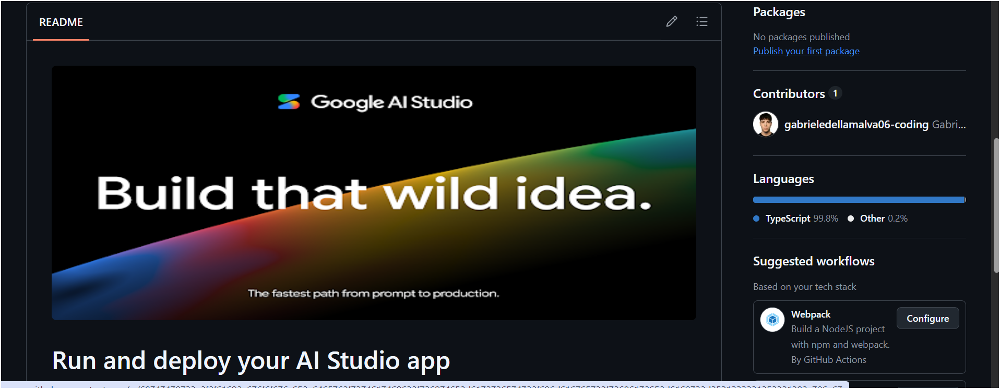

# Fluidnatek LE-500 Smart Memory

<p align="center">
  <strong>Industrial knowledge platform for electrospinning process optimization</strong>
</p>

<p align="center">
  React · TypeScript · Firebase · Firestore · Google Gemini · Adaptive Excel Import
</p>

<p align="center">
  
</p>

---

## Overview

**Fluidnatek LE-500 Smart Memory** is an industrial SaaS platform designed for companies and laboratories working with Fluidnatek electrospinning systems.

The platform centralizes projects, formulations, machine setups, experimental runs, telemetry, process results and historical knowledge in a persistent cloud database. Its purpose is to transform isolated experiment files into structured, reusable process intelligence.

The product is being developed as a long-term industrial platform, not as a disposable prototype.

---

## Product Goals

Fluidnatek LE-500 Smart Memory is designed to:

- preserve experimental knowledge across users, computers and sessions;
- standardize heterogeneous Excel files into canonical data models;
- search historical experiments before starting a new run;
- identify successful process windows;
- support engineers with AI-assisted recommendations;
- reduce repeated failed experiments;
- provide traceability for projects, formulations, setups and results;
- prepare the software foundation for future Fluidnatek LE-500 machine integration.

---

## Current Capabilities

### Cloud persistence

Projects, formulations and experiments are persisted in **Google Firestore** through a repository-based data layer.

The application does not rely on browser local storage as the final source of truth for industrial data.

### Adaptive Excel Import Engine

The import engine is designed to avoid fixed-template assumptions.

It does not require:

- fixed header positions;
- fixed sheet names;
- fixed columns;
- fixed workbook templates.

The import pipeline is divided into independent modules:

```text
Excel Workbook
      │
      ▼
Extractor
      │
      ▼
Resolver
      │
      ▼
Normalizer
      │
      ▼
Validator
      │
      ▼
Learning + Confidence
      │
      ▼
Canonical Models
      │
      ▼
Firestore
```

### Smart historical memory

The platform maintains structured knowledge about:

- projects;
- materials;
- formulations;
- machine setups;
- process parameters;
- telemetry;
- experiment outcomes;
- learned aliases;
- historical process behavior.

### AI-assisted process analysis

Google Gemini is integrated through the backend for process suggestions and telemetry analysis.

The production workflow is being adjusted so that AI calls are explicitly triggered by the operator instead of being executed automatically during navigation. This prevents unnecessary quota usage and keeps the application usable when external AI services are temporarily unavailable.

### Modular enterprise architecture

The codebase separates application responsibilities into dedicated modules:

```text
src/
├── application/      # Use cases, orchestration and mappers
├── components/       # React UI components
├── config/           # Application configuration
├── core/             # Import and domain engine
├── hooks/            # React state integration
├── lib/              # Firebase and shared libraries
├── migrations/       # Controlled historical migrations
├── repositories/     # Firestore repositories
├── services/         # Infrastructure services
├── utils/            # Focused reusable utilities
└── types.ts          # Application-facing types
```

---

## Core Engine Responsibilities

The adaptive import engine follows strict module boundaries.

| Module           | Responsibility                                                  |
| ---------------- | --------------------------------------------------------------- |
| `extractor`    | Reads Excel workbooks and produces raw extracted structures     |
| `resolver`     | Recognizes the semantic meaning of sheets, fields and values    |
| `normalizer`   | Converts heterogeneous input into canonical domain models       |
| `validator`    | Verifies completeness, consistency and import quality           |
| `dictionaries` | Provides semantic and parameter dictionaries                    |
| `learning`     | Stores newly learned aliases, materials and parameter knowledge |
| `confidence`   | Calculates confidence scores for semantic decisions             |
| `pipeline`     | Coordinates the complete ingestion flow                         |
| `report`       | Produces import, validation and learning reports                |
| `types`        | Defines canonical domain structures                             |

This separation must remain intact as the product evolves.

---

## Technology Stack

### Frontend

- React
- Vite
- TypeScript
- Modern responsive CSS
- Component-based UI architecture

### Backend and infrastructure

- Node.js
- Express
- Firebase
- Firestore
- Firebase Authentication
- Google Gemini API

### Data processing

- Adaptive Excel parsing
- Semantic field resolution
- Canonical normalization
- Confidence scoring
- Historical learning
- Controlled migration tools

---

## Firebase and Firestore

The application uses Firebase as its cloud platform and Firestore as the persistent database.

Firebase configuration is supplied through environment variables. Secrets and environment-specific identifiers must not be committed to the repository.

Expected frontend variables:

```env
VITE_FIREBASE_API_KEY=
VITE_FIREBASE_AUTH_DOMAIN=
VITE_FIREBASE_PROJECT_ID=
VITE_FIREBASE_STORAGE_BUCKET=
VITE_FIREBASE_MESSAGING_SENDER_ID=
VITE_FIREBASE_APP_ID=
```

Expected backend variables:

```env
GEMINI_API_KEY=
APP_URL=
```

The configured Firebase project can be opened from the Firebase Console by selecting the project associated with `VITE_FIREBASE_PROJECT_ID`.

Do not place private API keys, service-account files or production secrets in this README.

---

## Local Development

### Prerequisites

- Node.js 20 or newer
- npm
- A Firebase project
- A Firestore database
- A valid Gemini API key

### Installation

```bash
git clone <repository-url>
cd fluidnatek-le-500-smart-memory-project
npm install
```

### Environment configuration

Create a local `.env` file in the project root:

```env
VITE_FIREBASE_API_KEY=your_value
VITE_FIREBASE_AUTH_DOMAIN=your_value
VITE_FIREBASE_PROJECT_ID=your_value
VITE_FIREBASE_STORAGE_BUCKET=your_value
VITE_FIREBASE_MESSAGING_SENDER_ID=your_value
VITE_FIREBASE_APP_ID=your_value

GEMINI_API_KEY=your_value
APP_URL=http://localhost:3000
```

Never commit the real `.env` file.

### Start the development environment

```bash
npm run dev
```

Open the local URL shown by Vite in the terminal.

### TypeScript validation

```bash
npm run lint
```

### Production build

```bash
npm run build
```

---

## Gemini Quota Behavior

A Gemini response with HTTP status `429` and code `QUOTA_EXCEEDED` means that the Google AI project has reached an active usage limit.

The current backend uses retry logic with exponential delays. The final production behavior will distinguish between:

- temporary rate limits, which may be retried;
- exhausted quota, which should stop immediately;
- unavailable AI, which should activate deterministic historical-memory fallback logic.

Planned interaction model:

```text
Open application
      │
      └── No Gemini request

Select project or experiment
      │
      └── No Gemini request

Press "Generate AI Recommendation"
      │
      └── One controlled Gemini request

Gemini unavailable
      │
      └── Historical Smart Memory fallback
```

The application must remain operational even when Gemini is unavailable.

---

## UX Fusion: Smart Memory 2.0

### Scheduled implementation window

**Tomorrow, 08:00–11:00**

The next major milestone is the complete fusion of two existing Fluidnatek applications.

### Source A — Fluidnatek LE-500 Smart Memory

Provides the scalable technical foundation:

- React and TypeScript;
- Firestore persistence;
- repositories and application services;
- adaptive Excel import;
- canonical data models;
- learning and confidence modules;
- Gemini backend integration;
- migration and traceability infrastructure.

### Source B — Fluidnatek AI Process Assistant

Provides the proven laboratory workflow:

- project-first navigation;
- materials and formulations management;
- setup selection;
- experimental run workflow;
- memory search before saving a run;
- historical similarity analysis;
- recommended process windows;
- expected processability and fiber diameter;
- warning and engineer-comment presentation.

### Fusion strategy

The Python/Streamlit application will not overwrite the React application.

Its workflow and usability will be recreated in React while preserving the existing Smart Memory architecture.

```text
Fluidnatek AI Process Assistant
        │
        ├── Laboratory workflow
        ├── Page sequence
        ├── Search Memory interaction
        ├── Decision support
        └── Operator usability
        │
        ▼
Controlled React UX Port
        │
        ▼
Fluidnatek LE-500 Smart Memory
        │
        ├── Firestore
        ├── Core Engine
        ├── Repositories
        ├── Application Services
        ├── Adaptive Excel Import
        ├── Historical Learning
        └── Gemini Integration
        │
        ▼
Fluidnatek Smart Memory 2.0
```

### Planned workflow

```text
Home
  │
  ▼
Project
  │
  ▼
Formulation
  │
  ▼
Machine Setup
  │
  ▼
Critical Process Parameters
  │
  ▼
Search Historical Memory
  │
  ▼
Historical Analysis
  │
  ▼
Optional AI Recommendation
  │
  ▼
Save Experimental Run
  │
  ▼
Results and Continuous Learning
```

### Planned deliverables for the fusion session

- workflow-driven application shell;
- simplified sidebar and navigation;
- new experiment wizard;
- dedicated Search Memory page;
- historical similarity results;
- expected processability metrics;
- recommended successful process window;
- warnings for out-of-range parameters;
- historical engineer comments;
- manual AI recommendation trigger;
- deterministic fallback when Gemini quota is unavailable;
- connection of the new workflow to existing Firestore services;
- preservation of all current domain and import-engine modules.

### Architectural rule

The fusion is a **UI and workflow migration**, not a destructive rewrite.

The following areas remain authoritative and must not be replaced by the reference application:

```text
src/core/
src/application/
src/repositories/
src/services/
src/migrations/
Firestore configuration
Canonical TypeScript domain models
```

---

## Product Roadmap

### Implemented foundation

- [X] React + Vite + TypeScript application
- [X] Firebase initialization
- [X] Firestore repositories
- [X] Project persistence
- [X] Formulation persistence
- [X] Experiment persistence
- [X] Adaptive import Core Engine
- [X] Learning and confidence modules
- [X] Historical migration tooling
- [X] Gemini backend integration
- [X] TypeScript validation workflow

### Immediate milestone

- [ ] Smart Memory 2.0 UX Fusion
- [ ] Workflow-based experiment creation
- [ ] Search Memory interface
- [ ] Manual AI request control
- [ ] Quota-safe AI fallback
- [ ] Unified results center

### Subsequent milestones

- [ ] Enterprise authentication and authorization
- [ ] Organization and tenant isolation
- [ ] Audit history
- [ ] Advanced semantic search
- [ ] Versioned formulations
- [ ] Experiment comparison workspace
- [ ] Advanced reporting and PDF export
- [ ] Real-time LE-500 integration
- [ ] Telemetry ingestion through WebSocket, SSE or MQTT
- [ ] Production monitoring and observability
- [ ] Automated testing and CI/CD
- [ ] Multi-environment deployment strategy

---

## Current Project Status

| Area                       | Status                                    |
| -------------------------- | ----------------------------------------- |
| Core architecture          | Implemented                               |
| Firestore persistence      | Implemented                               |
| Adaptive Excel engine      | Implemented                               |
| Historical migration       | Implemented                               |
| Gemini integration         | Implemented, quota-control update pending |
| Current user interface     | Operational                               |
| Smart Memory 2.0 UX Fusion | Scheduled                                 |
| Direct LE-500 integration  | Planned                                   |

---

## Development Principles

- Architecture quality takes priority over coding speed.
- Existing behavior must remain compatible.
- Destructive refactoring is forbidden.
- Each module must have one clear responsibility.
- Composition is preferred over monolithic classes.
- TypeScript must remain strictly typed.
- `any` is prohibited except in explicitly justified edge cases.
- Firestore is the persistent source of truth.
- Excel templates must never be assumed to have fixed structures.
- New functionality must be implemented incrementally and validated with zero TypeScript errors.

---

## Security

- Never commit `.env` files.
- Never commit Firebase service-account credentials.
- Never expose Gemini API keys in the frontend.
- Never publish production Firestore rules without review.
- Use least-privilege access for Firebase and deployment accounts.
- Validate all imported data before persistence.

---

## Documentation

Recommended project documentation:

```text
README.md
CHANGELOG.md
ROADMAP.md
RELEASE_CHECKLIST.md
.env.example
CLAUDE.md
docs/
└── images/
    └── dashboard.png
```

`CLAUDE.md` is not used by the running application. It is an engineering-instruction file for AI-assisted development tools. It should describe architecture rules, module responsibilities, TypeScript standards and safe modification practices.

---

## License and Ownership

This repository contains proprietary work for the Fluidnatek LE-500 Smart Memory initiative.

All product names, technical assets, process knowledge and associated documentation remain subject to the ownership and licensing terms defined by the project stakeholders.

---

## Project Vision

Fluidnatek LE-500 Smart Memory is intended to become a durable industrial knowledge layer for electrospinning operations.

The final platform will connect experimental history, adaptive import, process telemetry, operator decisions and AI-assisted optimization into one traceable system that improves continuously as new experiments are performed.
