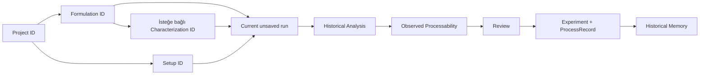

# Fluidnatek LE-500 Smart Memory — Uygulama Rehberi

> Bu belge, mevcut working tree içindeki kodun 14 Ağustos 2026 tarihinde incelenmesiyle hazırlanmıştır. Planlanan özellikler çalışan özelliklerden ayrılmıştır. Firestore anahtarları ve kimlik bilgileri bu belgeye alınmamıştır.

## 1. Uygulamanın amacı

Bu uygulama, Fluidnatek elektrospinning çalışmalarında geçmiş deney bilgisinin kaybolmasını önleyen bir “kurumsal deney hafızasıdır”. Operatör veya Ar-Ge çalışanı önce proje, çözelti/formülasyon ve makine kurulumunu seçer; planladığı proses değerlerini girer; benzer eski deneyleri inceler; fiziksel deneyi yaptıktan sonra gerçek proseslenebilirlik notunu girer ve deneyi tekrar kullanılmak üzere kaydeder.

Geçmiş verilere ihtiyaç vardır; çünkü aynı veya benzer polimer–çözücü sistemleri daha önce hangi koşullarda çalıştırıldı, hangi değerler kararlı sonuç verdi ve hangi kayıtlar eksik kaldı soruları yalnızca tek bir yeni formdan cevaplanamaz. “Smart Memory”, geçmiş kayıtları yalnızca listelemek değil, mevcut çözüm ile karşılaştırmak, kanıt miktarını göstermek ve güvenli bir başlangıç noktası çıkarmak demektir.

Hedef kullanıcı Ar-Ge mühendisi, laboratuvar teknisyeni veya elektrospinning operatörüdür. Uygulama sıradan bir kayıt uygulamasından; çözüm ve proses benzerliği hesaplaması, eksik veri farkındalığı, tarihsel kanıt seviyesi, aykırı değer/uzlaşı filtreleri ve öneriyi kaydetmeden önce kullanıcı onayına bırakmasıyla ayrılır. Bununla birlikte fiziksel simülasyon, nedensel tahmin veya makine kontrol sistemi değildir.

Kaynaklar: `src/App.tsx`, `src/components/RunConfig.tsx`, `src/features/experimental-assistant/*`.

## 2. Temel kavramlar

| Kavram | Ne olduğu ve içerdiği | İlişkisi | Firestore durumu |
|---|---|---|---|
| Project | Çalışmaları gruplandıran proje klasörü; ad, açıklama ve tarihler içerir. | Formulation ve çoğu Setup proje ID’si taşır; Experiment da canonical modelde projectId taşır. | `companies/default/projects` içinde saklanır. |
| Material | Tek bir hammaddenin canonical kaydıdır: ad, kategori, alias, ticari ad, ürün kodu, aile, molekül ağırlığı, tedarikçi ve metadata. | Formulation component’leri materialId ile bağlanır. | `materials` içinde saklanır. |
| Polymer | `Material.category = polymer` olan malzemedir. | Formülasyonun polymer rolündeki component’idir; aile ve molekül ağırlığı çözüm benzerliğinde kullanılabilir. | Ayrı collection değil, Material olarak saklanır. |
| Solvent | `Material.category = solvent` olan malzemedir. | Bir veya iki solvent component’i formülasyona bağlanır; ad/aile/oran benzerlikte kullanılır. | Ayrı collection değil, Material olarak saklanır. |
| Formulation / Solution | Bir projeye bağlı çözeltidir. Canonical model; isim, component listesi, hazırlama alanları ve characterization bağlantısı içerir. UI mapper; polimer/çözücü adlarını ve oranları okunabilir forma açar. | Project’e `projectId`, Material’a component `materialId`, Characterization’a formulationId ile bağlıdır. | `formulations` içinde saklanır. |
| Characterization | Çözeltinin ölçülen özellikleridir: katı madde, viskozite, iletkenlik, yoğunluk, yüzey gerilimi, pH, tarih ve not. | `formulationId` ile çözeltiye bağlıdır. | `solutionCharacterizations` içinde saklanır. Material characterization modeli de vardır; mevcut ana UI onu yüklemez. |
| Setup | Makine ve tekrar kullanılabilir donanım tanımıdır: makine, enjektör, kolektör, platform ve notlar. Projeye bağlı veya genel olabilir. | Experiment `setupId` taşır. | `setups` içinde saklanır. |
| Run | UI dilinde yürütülen/sonradan kaydedilen deney oturumudur. “Current run” henüz kaydedilmemiş form state’idir; kayıttan sonra Experiment + ProcessRecord olur. | Formulation, Setup ve girilen proses değerlerini birleştirir. | Kaydedilene kadar Firestore’da yoktur. |
| Experiment | Deney üst kaydıdır: projectId, formulationId, setupId, çalışma kodu, durum, processRecordIds, tarihler, not ve kalite bilgisi. | ProcessRecord’lara ID listesiyle bağlıdır. | `experiments` içinde saklanır. |
| Process parameters | HV+, HV−, debi, çalışma mesafesi, kolektör hızı vb. setpoint değerleridir. | ProcessRecord.parameters içinde tutulur. | ProcessRecord ile saklanır. |
| Telemetry / process record | Bir deneye ait koşul anlık görüntüsüdür; parametre, çevre, değerlendirme ve sıra içerir. UI bunu `telemetryData` dizisine map eder. | `experimentId`; Experiment tarafında `processRecordIds`. | `processRecords` içinde saklanır. `telemetry` yolu tanımlı olsa da mevcut akışta kullanılmaz. |
| Processability | Fiziksel deneyden sonra operatörün verdiği 1–4 süreçlenebilirlik derecesi ve yorumdur. | ProcessRecord.evaluation’a yazılır; analiz/öneride historical grade olarak okunur. | Kaydetme/güncellemede ProcessRecord’a yazılır. |
| Historical experiment | Firestore’dan yüklenen ve mapper ile UI Experiment biçimine çevrilen kayıtlı deneydir. | Analiz context’i formulation, project, setup ve son characterization ile birleştirir. | Kalıcıdır. |
| Current unsaved run | `RunConfig` içindeki o anki parametre, run adı, grade ve yorum state’idir. | Seçili proje/formülasyon/setup ile birlikte analiz sorgusu oluşturur. | “Save Run & Update Memory” öncesinde yalnızca local state’tir. |

Önemli ayrım: Setup donanımı tarif eder; Process parameters ise o deneyde girilen çalışma değerleridir. Characterization çözeltinin ölçümüdür; Processability ise fiziksel prosesin gözlenen sonucudur.

## 3. Baştan sona çalışma akışı

Kodda uygulanan ana sıra şöyledir:

1. **1. Current Project:** Kullanıcı proje seçer veya oluşturur. `activeProjectId` saklanır; formulation, characterization ve setup seçimleri temizlenir.
2. **2–3. Formulation & Characterization:** Seçilen projeye ait veya tüm formülasyonlar görüntülenir. Kullanıcı bir formülasyon seçer/oluşturur ve isterse ölçüm ekler. `selectedFormulationId` ve isteğe bağlı `selectedCharacterizationId` taşınır.
3. **4. Machine Setup:** Setup seçilir veya oluşturulur. `selectedSetupId` taşınır.
4. **5–8. Experimental Run — Parameters:** Seçili `project`, `formulation`, isteğe bağlı `characterization` ve `setup` ile `RunConfig` açılır. Operatör setpoint’leri ve run kodunu girer.
5. **Historical Analysis:** Parametre sınır doğrulamasından sonra geçmiş çözüm/proses karşılaştırmaları ve başlangıç önerileri görüntülenir. Öneriyi uygulamak yalnızca mevcut run state’ini değiştirir.
6. **Actual Processability:** Fiziksel deneyden sonra kullanıcı 1–4 grade ve yorum girer.
7. **Review & Save:** Özet onaylanır. Yeni/uygun setup, bir ProcessRecord ve bir Experiment batch ile Firestore’a yazılır; App içindeki `experiments` listesine eklenir.
8. **Historical Experiments:** Kaydedilen deney aranabilir, incelenebilir ve düzenlenebilir. Düzenleme mevcut Experiment ile onun ilk ProcessRecord’unu update eder.

Sidebar’dan sayfalara doğrudan geçilebilir. Ancak `LIVE_TELEMETRY` görünümü project, formulation veya setup eksikse form yerine “önce tamamlayın” uyarısı gösterir.

## 4. Veriler nereden geliyor?

Tüm yollar varsayılan olarak `companies/default/...` altındadır (`src/config/collectionPaths.ts`).

| Veri / collection | Ne saklar? | Nerede okunur? | Nerede yazılır? | Hangi ID ile bağlanır? |
|---|---|---|---|---|
| `projects` | Proje kimliği ve tanımı | `projectService.getProjects`, App yüklemesi | `createProject` → repository `save` | `project.id`; formulation.projectId |
| `materials` | Canonical hammaddeler | material ve formulation servisleri | Manuel material veya formulation sırasında yeni canonical material | `material.id`; component.materialId |
| `formulations` | Çözelti ve component listesi | `formulationService.getFormulations` | `createFormulation` | `formulation.id`; experiment.formulationId |
| `solutionCharacterizations` | Çözelti ölçümleri | characterization ve formulation servisleri | `createCharacterization` | `formulationId` |
| `setups` | Makine/enjektör/kolektör tanımı | setup ve experiment servisleri | Setup oluşturma; deney kaydında eşdeğer setup yoksa batch set | `setup.id`; experiment.setupId |
| `experiments` | Deney üst kaydı | `experimentService.getExperiments` | Deney save batch; edit sırasında update | `experiment.id`; ProcessRecord.experimentId |
| `processRecords` | Proses parametreleri, çevre ve değerlendirme | `experimentService.getExperiments` | Deney save batch; edit sırasında ilk record update | `processRecord.id`; experiment.processRecordIds |
| `materialCharacterizations` | Deney sonrası malzeme sonucu modeli | Ana App yüklemesinde okunmuyor | Mevcut UI yazmıyor | experimentId |
| `telemetry` | Yol tanımlı | Mevcut ana akışta okunmuyor | Mevcut ana akışta yazılmıyor | Doğrulanamadı |

### Shared Firestore ve local cache

`BaseRepository.getAll`, localStorage’daki aynı collection kaydı ile Firestore kayıtlarını ID bazında birleştirir; aynı ID’de local kayıt üstün gelir. Buna rağmen Firestore okuması hata verirse local cache sessiz fallback olarak kullanılmaz, hata fırlatılır. Yazmalarda önce Firestore, sonra localStorage güncellenir. Bu nedenle “shared Firestore” esas kaynak, localStorage ise yazılan belgelerin yerel kopyasıdır.

App başlangıçta projects, materials, formulations, characterizations, setups ve experiments koleksiyonlarını paralel okur. Firestore başarıyla dönüp bazı listeler boşsa yalnız projects/formulations/experiments için seed veri ekrana konur; materials, characterizations ve setups için seed fallback yoktur. Seed kayıtları bu durumda yalnız App state’indedir, otomatik Firestore yazısı değildir.

### Legacy Excel ve mapping

İki legacy yol vardır:

- UI’daki **Historical Data Import**, `parseElectrospinningExcel` ile dosyayı parse eder. Gerekli telemetry/grade/geçerli sayılar yoksa satırı atlar. Uygun formulation bulur; bulamazsa ancak canonical polymer ve solvent material bulunursa formulation oluşturur. Sonra her geçerli satır `experimentService.createExperiment` üzerinden gerçek Firestore Experiment + ProcessRecord’a dönüşür.
- `src/migrations/historical/sectionA.mapper.ts`, ayrı migration akışı için legacy project/material/formulation/setup/run/result kayıtlarını canonical modellere dönüştürür. Eksik değerleri çoğunlukla `undefined` olarak korur; incomplete run’ı `draft` ve `review_required` yapar.

Canonical Material modeli `core/types/material.ts` içindedir. `historicalExperiment.adapter.ts`, gösterim için polymer alias’larını (PCL, PEO vb.) ve LE-100/LE-500 makine adlarını normalize eder; raw Firestore belgesini değiştirmez. Polymer/solvent türünde önce experiment metadata, sonra canonical material family, sonra category fallback’i kullanılır.

### Missing değerler, sanitization ve ID’ler

Firestore sanitization (`sanitizeFirestoreValue`) nesnelerdeki `undefined` alanları kaldırır; dizilerdeki `undefined` elemanları da filtreler. `null`, sıfır ve diğer gerçek değerler korunur. Mapper’ların bazı UI alanlarında eksik sayıyı `0` göstermesi ayrı bir risktir; örneğin canonical process alanı yoksa `mapCanonicalExperimentToUi` HV+, debi ve mesafeyi 0’a map edebilir.

ID’ler kullanıcı tarafından edit ekranında değiştirilemez. Project/Formulation/Setup/Experiment/ProcessRecord ID’leri ve bağlantı alanları edit formunda yoktur. Yeni canonical entity ID’leri çoğunlukla prefix + `crypto.randomUUID()` ile üretilir; formulation sırasında adı yeni olan material için kategori+normalize adından kararlı hash ID üretilir. Firestore document ID’si entity ID ile aynıdır; manuel material creation ise Firestore `addDoc` ID’sini kullanır.

## 5. App.tsx ve global state

`App.tsx` gerçek uygulama orkestratörüdür. Ana diziler: `projects`, `materials`, `formulations`, `characterizations`, `setups`, `experiments`. Seçimler: `activeProjectId`, `selectedFormulationId`, `selectedCharacterizationId`, `selectedSetupId`. Ekran durumu `currentView`; bağlantı/yükleme durumu `isDataLoading`, `dataError`, `dataSource`, `lastDataLoadAt`; sidebar durumu `isSidebarCollapsed`.

Current unsaved run App’te değil, `RunConfig` içinde tutulur: stage, yedi proses değeri, runName, processability, comments, validation/override, açık panel, seçili geçmiş deney ve öneri preview state’leri. Bu yüzden RunConfig unmount edilirse taslak run kalıcı değildir.

App child component’lere seçme callback’leri ve async create/update callback’leri yollar. Create callback’i servisi çağırır, Firestore başarılı olunca ilgili App dizisini günceller. Experiment update sonrası yalnız değişen experiment App dizisinde değiştirilir; service içindeki yeniden yükleme güncel process kaydını mapper’dan geçirir.

| Kullanıcı işlemi | Değişen local state | Firestore write var mı? | Etkilenen ekranlar |
|---|---|---|---|
| Project seçme | activeProjectId; diğer üç seçim temizlenir; ID localStorage’a yazılır | Hayır | Formulation, Setup ve Run erişimi/context |
| Project oluşturma | projects listesi, activeProjectId | Evet: projects | Project ve bağlı workflow |
| Material oluşturma | materials listesi; formdaki ilgili material seçimi | Evet: materials | Formulation seçicileri ve analiz ailesi/MW |
| Formulation oluşturma | formulations, gerekirse materials, selectedFormulationId | Evet: formulations ve bazen materials | Formulation, Run, history/analysis |
| Formulation düzenleme | Çalışan UI yok | Hayır | — |
| Characterization ekleme | characterizations, selectedCharacterizationId | Evet | Formulation context ve latest characterization |
| Setup seçme | selectedSetupId | Hayır | Run context |
| Setup oluşturma | setups, selectedSetupId | Evet | Setup ve Run |
| Run parametrelerini değiştirme | RunConfig form state | Hayır | Current run, analiz sorgusu, preview |
| Historical Analysis çalıştırma | stage/panel/search state; hesaplanan useMemo sonuçları | Hayır | Run’ın analysis bölümü |
| Recommendation uygulama | seçilen proses state’leri; preview kapanır | Hayır | Current run parametreleri ve sonraki analiz |
| Actual Processability girme | processability/comments | Hayır | Review özeti |
| Experiment kaydetme | experiments listesi; RunConfig stage/name/comments reset | Evet: setup gerekirse + processRecords + experiments | History ve sonraki analiz/öneriler |
| Saved Experiment düzenleme | edit form, sonra experiments listesinde replacement | Evet: mevcut experiment + ilk processRecord update | History, analysis ve recommendation |

Not: “Actual Processability kaydetme” tek başına ayrı write değildir; grade/comments ancak son “Save Run & Update Memory” ile yazılır.

## 6. Sayfa sayfa anlatım

### 6.1 1. Current Project

#### Sayfanın amacı

“Hangi araştırma projesinde çalışıyorum?” sorusunu cevaplar.

#### Kullanıcı ne yapıyor?

Arama alanıyla projeyi daraltır, dropdown’dan seçer veya “Create New Project” ile ad/açıklama girer. Seçimden sonra formulation/run sayısını görür ve “Continue to Formulation” ile ilerler.

#### Ekrandaki bilgiler nereden geliyor?

| Alan | Kaynak | Dosya/fonksiyon | Stored / calculated? |
|---|---|---|---|
| Proje listesi/ad/açıklama | Firestore → mapper → App state | `projectService.getProjects`, `mapCanonicalProjectToUi` | Stored, UI’ya map edilmiş |
| Proje sayısı | App state | `projects.length` | Calculated |
| Formulation/run sayısı | App dizileri | `ProjectsWorkspace` filtreleri | Calculated |
| Search | Form state | `search`, `filtered` | Local/calculated |

#### Arkada hangi kod çalışıyor ve butonlar

`ProjectsWorkspace` gerçek bileşendir. Seçim yalnız state/localStorage değiştirir. Create; boş adı reddeder, `projectService.createProject` ile Firestore’a yazar, listeye ekler ve seçer. Cancel yalnız create formunu kapatır. Continue yalnız `currentView` değerini değiştirir. Loading ve Firestore hataları App üst banner’ında gösterilir.

#### Ben bunu nasıl anlatmalıyım?

“Önce bütün deney verilerini bağlayacağımız projeyi seçiyoruz; seçim değişirse eski formulation ve setup seçimleri temizleniyor.”

#### Hata veya eksik veri

İsim boşsa validation mesajı; Firestore hatasında form ve global kırmızı banner görünür. Firestore boş projects döndürürse seed projects ekranda gösterilebilir.

### 6.2 2–3. Formulation & Characterization

#### Sayfanın amacı

“Hangi çözeltiyi kullanıyorum ve bu çözeltinin ölçülmüş özellikleri neler?” sorularını cevaplar.

#### Kullanıcı ne yapıyor?

Project/all scope seçer, arar, formulation seçer. Yeni formulation için ad, polymer, concentration, solvent 1/oran, isteğe bağlı solvent 2/oran ve not girer. Listede malzeme yoksa inline yeni material oluşturabilir. Seçili formulation’a characterization formundan ölçümler ekleyebilir ve sonra Setup’a geçer.

#### Ekrandaki bilgiler nereden geliyor?

| Alan | Kaynak | Dosya/fonksiyon | Stored / calculated? |
|---|---|---|---|
| Polymer/solvent seçenekleri | Firestore materials | `Formulations`, Material category filtresi | Stored |
| Formulation listesi | Firestore canonical + mapper | `getFormulations`, `mapCanonicalFormulationToUi` | Mapped |
| Solvent metni | Component/material | `formatSolvent`, `buildSolventLabel` | Calculated |
| Solids, viscosity, conductivity, density | Son/bağlı characterization; bazı fallback’ler | `resolveCharacterization` | Stored + mapped |
| Create formları | Component state | `form`, `newMaterial`, `charForm` | Unsaved local |

#### Arkada hangi kod çalışıyor ve butonlar

Formulation create; proje, polymer ve solvent 1 zorunluluğunu kontrol eder; solvent 2 açıksa seçim ister. `createCanonicalFormulation` mevcut adı eşleştirir veya stable-ID material oluşturur, component’leri kurar ve Firestore’a yazar. Material create kısa/tam ad kontrolü yapar ve `materialService.createMaterial` kullanır. Characterization save, formulation varlığını ve sayı aralıklarını service’te doğrular ve ayrı belge yazar. Select ve scope/search yalnız local/App state’tir. Mevcut formulation edit butonu yoktur.

#### Ben bunu nasıl anlatmalıyım?

“Burada çözeltinin reçetesini canonical malzemelerle bağlıyoruz; karakterizasyon ise reçeteden ayrı, tarihlenmiş ölçüm kaydıdır.”

#### Hata veya eksik veri

Eksik seçim ve geçersiz ölçümler mesaj üretir. UI bazı legacy `unknown`, `n/d`, `not specified` metinlerini görünümde boş kabul eder. Characterization yoksa ölçüm kartları boş/0 fallback’leriyle sınırlı bilgi gösterebilir.

### 6.3 4. Machine Setup

#### Sayfanın amacı

“Deney hangi makine ve donanım düzeniyle yapılacak?” sorusunu cevaplar.

#### Kullanıcı ne yapıyor?

LE-500/LE-100 filtresi ve aramayla setup seçer veya setup adı, makine, üretici/seri, enjektör, iğne/emitter, kolektör ölçüleri, platform ve notları girerek oluşturur. Seçimden sonra “Continue to Experimental Run” ile ilerler.

#### Ekrandaki bilgiler nereden geliyor?

| Alan | Kaynak | Dosya/fonksiyon | Stored / calculated? |
|---|---|---|---|
| Setup listesi/donanım | Firestore setups | `setupService.getSetups` | Stored |
| LE makine filtresi | Setup machine.model | `normalizeMachine` | Calculated |
| Görünen setup etiketi | name veya donanım fallback’i | `setupLabel` | Calculated |
| Create alanları | Component form | `SetupForm` | Local |

#### Arkada hangi kod çalışıyor ve butonlar

Select/filter/search local state’tir. Create; zorunlu dört metni ve pozitif opsiyonel sayıları doğrular, project varsa varlığını kontrol eder ve `setupRepository.save` ile yazar. Continue yalnız view değiştirir.

#### Ben bunu nasıl anlatmalıyım?

“Setup, o anki voltaj veya debi değil; yeniden kullanılabilen makine–enjektör–kolektör tanımıdır.”

#### Hata veya eksik veri

Zorunlu alanlar yoksa form durur. Pozitif tamsayı/sayı olmayan opsiyonel donanım ölçüleri service hatası verir. Setup seçilmeden Run’a gidilirse App uyarı gösterir.

### 6.4 5–8. Experimental Run

#### Sayfanın amacı

“Hangi değerlerle başlayacağım, geçmiş ne söylüyor, fiziksel deney nasıl sonuçlandı ve bunu hafızaya nasıl kaydederim?” sorularını tek akışta cevaplar.

#### Kullanıcı ne yapıyor?

1. Q1, HV+, HV−, sıcaklık, RH, dZ, drum speed ve run code girer.
2. İsterse basit Smart Starting Point’i uygular.
3. “Analyze Similar Historical Runs” ile analysis stage’e geçer.
4. Similar Solutions / Similar Process Conditions ve Recommended Starting Parameters panellerini inceler; ayrıntılı öneriyi preview + confirm ile current run’a kopyalayabilir.
5. “Continue to Actual Processability” sonrası gerçek grade ve yorum girer.
6. “Review & Save” ile özet açar ve son Save ile Firestore’a yazar.

#### Ekrandaki bilgiler nereden geliyor?

| Alan | Kaynak | Dosya/fonksiyon | Stored / calculated? |
|---|---|---|---|
| Project/formulation/setup context | App seçimleri + Firestore | `ContextStrip` | Stored/mapped |
| Proses setpoint’leri | `RunConfig` state | NumericField’lar | Current form |
| Historical matches | App experiments + context | similarity engine’leri | Dynamic calculated |
| Recommendation | Solution matches | `buildInitialParameterRecommendation` | Dynamic calculated |
| Grade/comments | Operator | processability/comments state | Current form |
| “Machine telemetry unavailable” | Sabit UI | `RunConfig` | UI etiketi; gerçek telemetry değildir |

#### Arkada hangi kod çalışıyor ve butonlar

Focus mode sadece context görünürlüğünü değiştirir. Analyze; configured limitleri kontrol eder, sınır dışıysa kullanıcı explicit unsafe override işaretlemeden ilerlemez. Bu limitler resmi datasheet machine limitleri olarak doğrulanmamıştır. Smart point ve recommendation apply yalnız setter’ları çağırır. Adjust/Back/Edit stage’i geri alır. Son Save `experimentService.createExperiment` çağırır: formulation/project doğrular, eşdeğer setup arar, gerekirse yenisini üretir ve Setup + ProcessRecord + Experiment’ı batch yazar. Başarıda stage parameters’a döner; yalnız runName/comments temizlenir, proses değerleri ve grade varsayılana dönmez.

#### Ben bunu nasıl anlatmalıyım?

“Bu ekran makineyi canlı sürmüyor; operatörün girdiği setpoint’leri geçmiş kanıtla karşılaştırıyor, gerçek sonucu kaydedince kurum hafızasını büyütüyor.”

#### Hata veya eksik veri

Run code boşsa save olmaz. Zorunlu proses sayıları service tarafından ayrıca doğrulanır. Firestore hatası kırmızı mesaj olur. DataHub bağlı değildir. Benzer geçmiş kayıt yoksa paneller “No data/No comparable historical runs” gösterir; bu kayıt oluşturmayı engellemez.

### 6.5 Historical Experiments

#### Sayfanın amacı

“Daha önce ne yapıldı ve kayıt doğru mu?” sorusunu cevaplar.

#### Kullanıcı ne yapıyor?

Arama, project/polymer/type/solvent/machine/grade ve sayısal aralık filtrelerini kullanır; kolonları sıralar; satırı açıp ayrıntıları görür; “Edit Experiment” ile run adı, yedi proses/çevre alanı, grade ve comments’i değiştirir.

#### Ekrandaki bilgiler nereden geliyor?

| Alan | Kaynak | Dosya/fonksiyon | Stored / calculated? |
|---|---|---|---|
| Liste | App experiments/formulations/projects | `adaptHistoricalExperiments` | Mapped/normalized |
| Polymer/machine adları | Canonical + alias normalizer | `normalizePolymerName`, `normalizeMachineModel` | Display normalized |
| Sayısal değerler | İlk ilgili telemetry | `selectRepresentativeTelemetry` | Stored → selected |
| Filtre seçenek/sayıları | Listedeki kayıtlar | `createHistoricalExperimentFilterOptions` | Calculated |
| Edit alanları | Seçilen record | `toEditValues` | Local draft |

#### Arkada hangi kod çalışıyor ve butonlar

Filtre, sort, reset, row/detail açma local state’tir. Edit açmak yazmaz. Cancel değişiklik varsa browser confirm ister. Save önce “analiz ve önerileri etkiler” confirmation’ı ister; service boş run adı, finite sayılar ve 1–4 grade doğrular. Mevcut Experiment update edilir, `processRecordIds[0]` ile yalnız ilk ProcessRecord update edilir, tüm experiments tekrar yüklenir ve App’te aynı ID replacement yapılır. Yeni/duplicate Experiment oluşturulmaz.

#### Ben bunu nasıl anlatmalıyım?

“Bu sayfa kayıtlı deney hafızasının denetim ekranıdır; düzeltme aynı belge kimliğini korur ve sonraki analizleri doğrudan etkiler.”

#### Hata veya eksik veri

Loading/error/empty-filter sonuçları ayrı gösterilir. Eksik telemetry `null` olarak korunur ve filtre aralığı kullanılırsa eşleşmez. Update sırasında process record yoksa edit reddedilir. Birden fazla ProcessRecord varsa yalnız ilk ID güncellenir; bu açık veri tutarlılığı riskidir.

### 6.6 Historical Data Import

#### Sayfanın amacı

“Eski veya harici Excel deneylerini hangi projeye aktarırım?” sorusunu cevaplar.

#### Kullanıcı ne yapıyor?

Hedef proje seçer, Excel format rehberini açabilir, dosyaları drop/click ile yükler; parsed sonuçları arayıp gözden geçirir.

#### Ekrandaki bilgiler nereden geliyor?

| Alan | Kaynak | Dosya/fonksiyon | Stored / calculated? |
|---|---|---|---|
| Hedef projeler | App projects | `ExcelImport` | Stored/mapped |
| Parsed runs | Kullanıcı dosyası | `parseElectrospinningExcel` | Local parsed |
| Review/search | results state | `filteredResults` | Local/calculated |
| Import sonucu | App handler | `handleImportExperiments` | Firestore sonucu mesajı |

#### Arkada hangi kod çalışıyor ve butonlar

Proje seçilmeden import reddedilir. Parser dosyadaki başlıkları/telemetry’yi çözer. App eşleşen formulation arar; canonical materials ile yenisini oluşturabilir. Telemetry, grade veya temel sayılar geçersizse satır skip edilir. Geçerli her satır Experiment + ProcessRecord olarak yazılır. Import tek atomik bütün değildir; satırlar sırayla yazıldığı için ortada hata olursa önceki satırlar kalmış olabilir.

#### Ben bunu nasıl anlatmalıyım?

“Eski Excel satırlarını önce parse edip kontrol ediyor, yeterli bağlantı ve ölçüm varsa canonical Firestore deneylerine dönüştürüyoruz.”

#### Hata veya eksik veri

Eksik satırlar atlanır ve sayı mesajda bildirilir. Parser boş ölçümü uydurmaz; testte eksik flow içeren kayıt telemetry üretmez ve grade 0 kalır. Bununla birlikte import validation’ı drum/çevre değerlerini zorunlu tutmaz.

## 7. Historical Analysis

### 7.1 Similar Solutions

`searchSimilarSolutionExperiments` yalnız çözüm bileşimini karşılaştırır; proses parametrelerini solution score’a katmaz.

Beş karşılaştırılabilir kriter ve ağırlıkları:

| Kriter | Ağırlık | Davranış |
|---|---:|---|
| Polymer adı | 35 | Normalize adlar aynıysa veya biri diğerini içeriyorsa eşleşir. |
| Polymer family | 15 | Canonical material family eşleşmesi; exact polymer yoksa family fallback olabilir. |
| Molecular weight | 15 | `kDa` doğrudan sayı, `MDa` ×1000 normalize edilir; birimsiz sayı da kabul edilir. |
| Polymer concentration | 15 | 0 fark=1; ≤1=0.85; ≤2=0.65; ≤5=0.35; daha büyük=0. |
| Solvent system/oran | 20 | Aynı solvent ad seti; ilk oran farkına göre `max(0,1−fark/100)`. Sadece aynı family varsa 0.45 veya adlar farklı ama family aynıysa 0.35. |

Gerçek formül:

`Solution Similarity % = 100 × kazanılan ağırlık / mevcut sorgu ve karşılaştırılabilir alanların toplam ağırlığı`

Örnek: polymer tam eşleşme 35, concentration farkı 1 puan olduğu için 15×0.85=12.75, aynı solvent ve 10 puan oran farkı için 20×0.90=18; başka alan yoksa skor `(35+12.75+18)/(35+15+20)×100 = 93.93%` olur. Bu oran fiziksel başarı olasılığı değildir.

Molekül ağırlığı örneği: 100 kDa ile 110 kDa farkı `10/110≈9.1%` olduğu için MW alt skoru 0.75; 100 ile 130 farkı yaklaşık %23 olduğu için 0.45; %25’ten büyükse 0’dır. Parser sadece `sayı`, `kDa`, `MDa` biçimlerini kabul eder; örneğin karmaşık aralık metni missing sayılır.

Missing alan score’u otomatik sıfırlamak yerine çoğunlukla paydaya alınmaz; fakat polymer/family query mevcutken historical taraf eksikse ilgili ağırlık paydaya girer ve puan gelmez. `comparableCriteriaCount/5` completeness’tir. Evidence: ≥4 strong, ≥3 moderate, aksi limited; ayrıca temel solution verisi bulunmalıdır.

Tier: tam polymer+MW+concentration+solvent tamlığı 4; exact polymer+solvent karşılaştırması 3; yalnız exact polymer 2; family fallback 1. Liste sıralaması doğrudan similarity değildir:

`rankingScore = similarity×0.60 + completeness×25 + success×15`, burada `success = grade/4` (geçerli grade varsa).

Dolayısıyla grade similarity hesabına karışmaz; yalnız sıralamada ayrı tarihsel başarı sinyali olarak kullanılır. Ekranda similarity ve historical grade ayrı badge’lerdir. Deney satırına tıklanınca `selectedHistoricalId` değişir ve inline `ExperimentComparison` açılır; tekrar tıklamak kapatır.

### 7.2 Similar Process Conditions

Kullanıcı Flow Rate, HV+, HV−, Temperature, RH, Working Distance ve Drum Speed alanlarından istediğini checkbox ile seçer. Checkbox’lar bilerek başlangıçta boştur: kullanıcı hangi parametreleri gerçek arama constraint’i sayacağını açıkça seçer; formulation değişince veya tab/panel resetinde yine temizlenir.

Her seçili parametre için:

`eşik = max(mutlak tolerans, |current| × bağıl tolerans)`

`yakınlık = max(0, 1 − |current − historical| / eşik)`

| Parametre | Mutlak tolerans | Bağıl tolerans |
|---|---:|---:|
| Flow | 0.2 mL/h | %20 |
| HV+ | 2 kV | %10 |
| HV− | 1 kV | %15 |
| Temperature | 5 °C | %20 |
| RH | 5 puan | %15 |
| Distance | 10 mm | %10 |
| Drum speed | 25 rpm | %15 |

Örnek: current temperature 20 °C ise eşik `max(5,4)=5`; historical 22.5 ise yakınlık `1−2.5/5=0.5` yani %50; historical 25 ise 0’dır ve bu tek kriterse aday elenir. Bu formül “25 °C fiziksel olarak başarısız olur” demek değildir; yalnız yapılandırılmış yakınlık penceresinin kenarıdır.

Process Similarity, historical kayıtta mevcut karşılaştırılabilir seçili alanların yakınlık ortalamasıdır. Completeness `mevcut karşılaştırılan/seçilen` oranıdır. Overall Match/ranking:

`0.70 × processSimilarity + 0.30 × processCompleteness`

En az bir yakınlık >0 olmalı; hiç ölçümü olmayan veya tüm yakınlıkları 0 olan kayıt elenir. Completeness 1 ise strong, ≥0.5 moderate, aksi limited evidence. “Eligibility” pratikte bu şartlardan geçip sonuç listesine girebilmektir; çözüm/project filtresi zorunlu değildir. Bu nedenle başka proje veya başka solution deneyleri de çıkar; onların solution similarity ve grade’i ayrı gösterilir.

Observed Parameters, arama constraint’i olarak seçilmeyen alanların eşleşen geçmiş kayıtlardaki min–max aralığını ve destek sayısını gösterir; öneri veya nedensel sonuç değildir. Sonuca tıklamak comparison’ı inline açar, tekrar tıklamak kapatır.

## 8. Current vs Historical Comparison

Current run, `RunConfig` state’inden oluşturulan snapshot’tır. Historical run, seçilen `SolutionSimilarityMatch.context.experiment` ve ilk uygun telemetry kaydıdır. Raw historical değerler mapper/context içinde korunur; comparison yalnız görüntü satırı üretir. Aykırı bir değer recommendation’da dışlansa bile Experiment kaydından silinmediği için comparison’da görünmeye devam eder.

Metin alanlarında iki taraf da yoksa satır gösterilmez; bir taraf eksikse “No data”; normalize metin tam eşitse “Same”; ikisi de var ama eşit değilse “Close” yazılır. Bu yüzden metinsel “Close” semantik benzerliğin ayrıntılı ölçüsü değildir.

Sayısal process satırlarında historical eksikse “No data”. Aksi halde `threshold = max(absolute, |current|×relative)` hesaplanır. Fark bu eşiğin içindeyse “Close (+/− fark)”, dışındaysa “Different” olur. Sayısal comparison’da exact değer için ayrı “Same” etiketi yoktur; fark 0 da “Close” olarak görünür. Tolerance kaynağı `processParameterTolerances.ts` dosyasıdır.

Grade `experiment.jetStabilityGrade`, comments `operatorComments`, project/formulation/setup metadata ise context ve canonical ID mapper’larından gelir. Comparison hiçbir değeri düzeltmez veya yazmaz.

## 9. Recommended Starting Parameters

Bu ayrıntılı panelin kaynağı solution similarity listesidir. Süreç parametrelerine göre kaynak seçmez; amaç “benzer çözeltiler geçmişte hangi başlangıç değerleriyle işlendi?” sorusudur. Önce `comparableCriteriaCount >= 3` olan solution matches eligible kabul edilir. Grade ≥3 olanlar “successful” sayılır.

Her parametre ayrı hesaplanır; çünkü bir deneyde sıcaklık varken HV− eksik olabilir ve bir parametrede aykırı olan kayıt diğerinde yararlı olabilir. Her deneyden ilk herhangi bir geçerli proses değeri taşıyan representative telemetry alınır.

Hesap sırası:

1. İlgili parametresi missing/finite olmayan kaynak atılır.
2. En az 4 değer varsa IQR filtresi uygulanır: `IQR=Q3−Q1`, kabul aralığı `[Q1−1.5×IQR, Q3+1.5×IQR]`.
3. Kalan değerlerin medyanı consensus center olur. `consensusTolerance=max(abs tolerance, |median|×relative tolerance)` dışında kalanlar `no-consensus` olur.
4. En az iki uyumlu destek yoksa numeric öneri üretilmez.
5. Her kabul edilen kaynağın ağırlığı: `(solutionSimilarity/100) × successWeight`. Grade ağırlıkları 1→0.1, 2→0.35, 3→0.7, 4→1; geçersiz/missing grade→0.1.
6. Öneri `Σ(value×weight)/Σweight`; usable range yalnız son kabul edilen değerlerin min–max’ıdır.

Evidence level:

- High: en az 4 destek, en az 3 successful, ortalama similarity quality ≥0.65.
- Medium: en az 2 destek, en az 1 successful, quality ≥0.40.
- Low: iki destek vardır ama medium şartları yoktur; güvenilir numeric value özellikle dönülmez.
- Insufficient: iki desteğin altı.

“Why this recommendation?” included ve excluded kaynakları, raw value, solution similarity, grade, success/contribution weight ve dışlama nedenini gösterir. “Apply this recommendation” checkbox’ları güvenilir parametreleri seçer. “Use selected starting parameters” preview’da current/proposed değerleri gösterir; “Confirm and copy” yalnız current unsaved run setter’larını çağırır. Firestore’a otomatik yazmaz; operatör önce değerleri incelemeli, fiziksel deneyi yapmalı ve en son kaydetmelidir.

Kod testlerindeki sonuçlar:

| Girdi | Sonuç | Neden |
|---|---|---|
| Flow `[1, 1, 1222]` | Öneri 1; range 1–1; 1222 `no-consensus` | 3 elemanda IQR uygulanmaz; medyan 1 çevresindeki flow toleransı 0.2, uç değer dışlanır; iki destek kalır. |
| Temperature `[25, 2522]` | No reliable historical recommendation | Medyan 1273.5; consensus toleransı %20 ile 254.7; iki değer de merkezin çok dışında, destek 0. |
| Humidity `[40, 100]` | No reliable historical recommendation | Medyan 70, tolerans max(5,10.5)=10.5; iki değer de dışarıda. |
| HV− `[0, 0]` | Öneri 0 | Sıfır missing sayılmaz; medyan 0, mutlak tolerans 1 ve iki uyumlu destek vardır. |

Dört değerli `[1,1,1,1222]` durumunda 1222 önce IQR outlier olur; bu statü `no-consensus`tan ayrıdır. “No reliable historical recommendation” bir çalışma hatası değil, yetersiz/uyumsuz kanıttan sayı uydurmayı engelleyen güvenlik davranışıdır.

## 10. Edit Experiment

Edit, **Historical Experiments** detay panelindeki “Edit Experiment” düğmesinden açılır. Değiştirilebilir alanlar: run name, flow, HV+, HV−, temperature, RH, distance, drum/collector speed, processability grade ve comments.

Değiştirilemeyenler: experiment ID, projectId, formulationId, setupId, processRecordIds, material characterization bağlantıları ve document kimlikleri. Edit formu bunları sunmaz.

Cancel, draft ilk değerlerle aynı değilse “Discard unsaved changes?” onayı ister; onay yoksa form açık kalır. Save ayrı bir confirmation ile düzeltmenin Historical Analysis ve recommendations’ı etkileyebileceğini bildirir.

`experimentService.updateExperiment(id,input)` yeni belge oluşturmaz. Mevcut Experiment’a operationIdentifier/notes/updatedAt patch’i, mevcut ilk ProcessRecord’a parameters/environment/evaluation patch’i yollar. Repository `update` Firestore `updateDoc` ve local cache update yapar. Sonra bütün experiments yeniden okunur, aynı ID bulunur ve App state’te replacement yapılır. Bu yüzden duplicate experiment oluşmaz.

Grade değişince `jetStabilityGrade`, `processabilityGrade` ve `isStable = grade>=4` birlikte güncellenir. Yeni deney oluşturma sırasında ise mapper yalnız `jetStabilityGrade` ve `isStable` yazar; bu küçük model tutarsızlığıdır.

Bir Experiment birden fazla `processRecordIds` taşıyabilir. Edit kodu açıkça `experiment.processRecordIds[0]` kullanır ve yalnız o belgeyi günceller. Diğer process record’lar aynı kalır. UI read mapper bütün record’ları sequence ile sıralayıp telemetryData’ya koysa da edit edilen ID dizinin ilk ID’sidir; bunun sequence sırasındaki ilk kayıt olması garanti edilmez. Bu önemli tutarlılık riskidir.

Güncelleme App state’e yansıdığı için sonraki `buildHistoricalContexts`, solution/process analysis ve recommendation hesapları yeni değer ve grade’i kullanır; sürüm geçmişi tutulmaz.

## 11. Neler henüz yok?

Mevcut render tree ve çağrılan servislerde aşağıdakiler uygulanmış değildir:

- Kullanıcının sabitlediği process constraint’lerine göre **Recommend Remaining Parameters**.
- Elektrospinning fiziksel simülasyonu.
- “Voltaj artarsa sonuç ne olur?” türü causal prediction.
- Resmî LE-500 datasheet’e dayandığı doğrulanmış machine limits. `RECOMMENDATION_CONFIG.limits` vardır, fakat kod kaynak/provenance belirtmez.
- Live DataHub/telemetry. Ekran açıkça bağlantının olmadığını ve değerlerin operator-entered setpoints olduğunu söyler.
- Regression veya ML modeli. Mevcut hesaplar deterministik kural/istatistiktir.
- Experiment edit version history/audit trail.
- Çalışan kullanıcı rolleri ve yetki UI’si. Type tanımları bulunması çalışan authorization özelliği değildir.
- Kullanıcıya açık delete/restore. Repository’de genel delete metodu olsa da mevcut render tree’de buton/restore akışı yoktur.
- Formulation düzenleme akışı.
- Material characterization sonuçlarının ana App tarafından yüklenip gösterilmesi.

## 12. Terimler sözlüğü

| Terim | Türkçe anlamı |
|---|---|
| Similarity | İki kaydın seçilen alanlarda kurallara göre benzerlik derecesi; başarı olasılığı değildir. |
| Evidence | Hesaba gerçekten katılabilen alan ve deney desteği. |
| Completeness | Seçilen/beklenen kriterlerin ne kadarında iki tarafta da kullanılabilir veri bulunduğu. |
| Historical Grade | Operatörün geçmiş fiziksel deneye verdiği 1–4 processability notu. |
| Outlier | Diğer değerlerden IQR kuralına göre aşırı uzak olduğu için öneriden çıkarılan değer. |
| IQR | Üçüncü ve birinci çeyrek farkı; robust aykırı değer filtresinin temeli. |
| Consensus | Değerlerin medyan çevresindeki parametre toleransı içinde uzlaşması. |
| Weighted value | Her değerin solution similarity ve grade ağırlığıyla katkı yaptığı ortalama. |
| Setpoint | Operatörün makine için planlayıp forma girdiği hedef değer; canlı ölçüm değildir. |
| Constraint | Kullanıcının process search’e dahil etmeyi seçtiği karşılaştırma şartı. |
| Telemetry | Zaman/süreç koşulu kaydı. Bu uygulamada UI’daki kayıtlar Firestore ProcessRecord’dan map edilir; canlı DataHub değildir. |
| Processability | Çözeltinin seçilen koşullarda işlenebilmesine ilişkin gözlenen 1–4 derece. |
| Current run | Henüz kaydedilmemiş, bellekteki form ve seçimler. |
| Historical run | Firestore’dan yüklenmiş Experiment ve bağlı process kayıtları. |

## 13. Önemli dosyalar

| Dosya | Görevi | Önemli component/fonksiyon | Read/write |
|---|---|---|---|
| `src/App.tsx` | Global yükleme, seçimler, render tree, callback orkestrasyonu | `App`, `renderMainView`, `ProjectsWorkspace` | Read + servisler üzerinden write |
| `src/components/Sidebar.tsx` | Gerçek navigasyon | `Sidebar`, `MainView` | Local view change |
| `src/components/Formulations.tsx` | Formulation/material/characterization UI | `Formulations` | Read + create writes |
| `src/components/Setups.tsx` | Setup seçme/oluşturma | `Setups` | Read + create write |
| `src/components/RunConfig.tsx` | Current run, analysis, grade, review/save | `RunConfig`, `ProcessConditionSearch`, `ExperimentComparison` | Local + final create write |
| `src/components/HistoricalExperiments.tsx` | History query/detail/edit | `HistoricalExperiments`, `ExperimentEdit` | Read + update write |
| `src/components/ExcelImport.tsx` | Excel seçme/parse/review | `ExcelImport`, `processFiles` | File read + import callback write |
| `src/application/experiments/experiment.service.ts` | Experiment create/update ve ilişki doğrulama | `getExperiments`, `createExperiment`, `updateExperiment` | Read/write |
| `src/application/experiments/experiment.mapper.ts` | Canonical ↔ UI experiment/process mapping | `createCanonicalExperiment`, `mapCanonicalExperimentToUi` | Transform |
| `src/application/formulations/formulation.mapper.ts` | Component/material/characterization’ı UI solution’a dönüştürme | `mapCanonicalFormulationToUi`, `createCanonicalFormulation` | Transform |
| `src/services/firestore.service.ts` | Auth, CRUD, batch, sanitization | `sanitizeFirestoreValue`, `executeBatch` | Read/write |
| `src/repositories/base.repository.ts` | Firestore + local cache repository davranışı | `getAll`, `save`, `update` | Read/write |
| `src/config/collectionPaths.ts` | Collection yolları | `CollectionPaths` | Config/read |
| `src/features/experimental-assistant/contextBuilder.ts` | Historical ilişkileri birleştirme | `buildHistoricalContexts` | Read/transform |
| `src/features/experimental-assistant/similarity.engine.ts` | Genel ve solution similarity | `calculateSolutionSimilarity`, `searchSimilarSolutionExperiments` | Calculated |
| `src/features/experimental-assistant/processConditionSimilarity.engine.ts` | Seçili process constraints benzerliği | `calculateProcessConditionSimilarity` | Calculated |
| `src/features/experimental-assistant/processParameterTolerances.ts` | Comparison/consensus toleransları | `processParameterTolerances` | Config/read |
| `src/features/experimental-assistant/initialParameterRecommendation.ts` | IQR, consensus, weight ve kanıt | `buildInitialParameterRecommendation` | Calculated |
| `src/features/experimental-assistant/historicalAnalysis.ts` | Eski genel assessment/process window | `analyzeSimilarExperiments` | Calculated |
| `src/features/experimental-assistant/smartStartingPoint.ts` | Aynı formulation geçmişinin medyanları | `buildSmartStartingPoint` | Calculated |
| `src/features/historical-experiments/historicalExperiment.adapter.ts` | History ekranı view model’i | `adaptHistoricalExperiments` | Transform |
| `src/features/historical-experiments/historicalExperiment.normalizer.ts` | Display/search alias normalization | `normalizePolymerName`, `normalizeMachineModel` | Transform |
| `src/migrations/historical/sectionA.mapper.ts` | Legacy Section A → canonical mapping | `mapLegacy*` fonksiyonları | Transform; migration çağırırsa write başka katmanda |

## İnceleme sırasında bulunan risk ve tutarsızlıklar

1. **Çoklu ProcessRecord edit riski:** yalnız `processRecordIds[0]` güncellenir; diğerleri değişmez.
2. **Missing → 0 riski:** canonical experiment mapper bazı eksik proses alanlarını UI’da 0’a çevirir. Bu, eksik veri ile gerçek sıfırı analizde ayırt etmeyi zorlaştırabilir.
3. **Seed görünümü riski:** Firestore koleksiyonu boş olduğunda projects/formulations/experiments seed verisi App state’e gelir; bağlantı banner’ı yine Firestore bağlantısı gösterir. Kullanıcı seed’i shared kayıt sanabilir.
4. **Local merge riski:** aynı ID’de local cache Firestore sonucunun üzerine yazılır. Cache’in eski olması görünümde farklı veri oluşturabilir.
5. **Create/update evaluation farkı:** create `jetStabilityGrade` yazar; update buna ek olarak `processabilityGrade` yazar.
6. **Experiment status:** manuel kaydedilen deney fiziksel run tamamlandıktan sonra kaydedilse de canonical status `running` oluşturulur, `completed` değildir.
7. **Import kısmi yazma:** satırlar tek tek işlendiği için tüm dosya atomik değildir; ortadaki hata önceki yazıları geri almaz.
8. **Source file kaybı:** `CreateExperimentInput.sourceFile` alınmasına rağmen `createCanonicalExperiment` canonical `source` alanına bunu yazmaz; UI tekrar okuduğunda sourceFile çoğunlukla “Firestore” olur.
9. **Machine limits provenance:** UI’nın unsafe override kontrolünde kullanılan limitlerin resmî LE-500 datasheet kaynağı kodda doğrulanamamıştır.
10. **İki öneri mekanizması:** basit Smart Starting Point yalnız aynı formulation ve geçerli grade medyanlarını kullanır; ayrıntılı recommendation solution similarity + grade/IQR/consensus kullanır. Aynı ekranda farklı sonuç vermeleri mümkündür ve UI ayrımı kullanıcıya sınırlı açıklar.
11. **Delete altyapısı ama UI yok:** repository/service katmanında bazı delete metotları vardır; kullanıcıya açık delete/restore akışı bulunmaz.
12. **Kullanılmayan/ayrı bileşenler:** `Dashboard`, `AIInsights`, `AIOptimizationWidget`, memory Process Designer ve eski `ExperimentEditor` dosyaları mevcut olsa da `App.tsx` gerçek render tree’sinde sayfa değildir; bu nedenle gerçek sayfa listesine dahil edilmemiştir.

